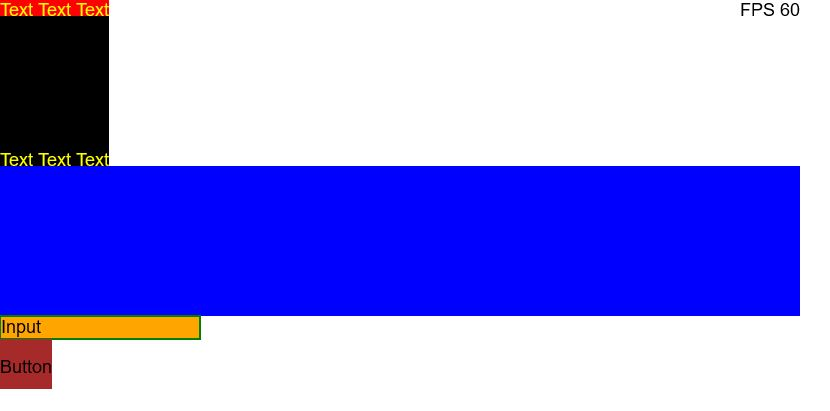

## Reacten - Run you React Native apps everywhere
*this is just a hack not a useable product product

### Goals
Create a 100% react native compatible library which will use geometry primitives to render the UI instead of native component. This way the UI will be consistent on all platforms. 

em++ main.cpp -s EXPORT_ES6=1 -s ENVIRONMENT=web -s ENVIRONMENT_MAY_BE_WORKER=0 -s WASM=1

1. setup env
2. emcmake cmake .
3. emmake make

https://hacks.mozilla.org/2017/10/the-whole-web-at-maximum-fps-how-webrender-gets-rid-of-jank/